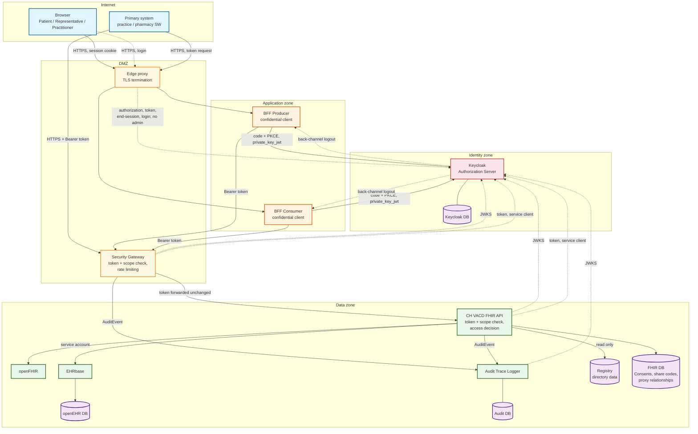
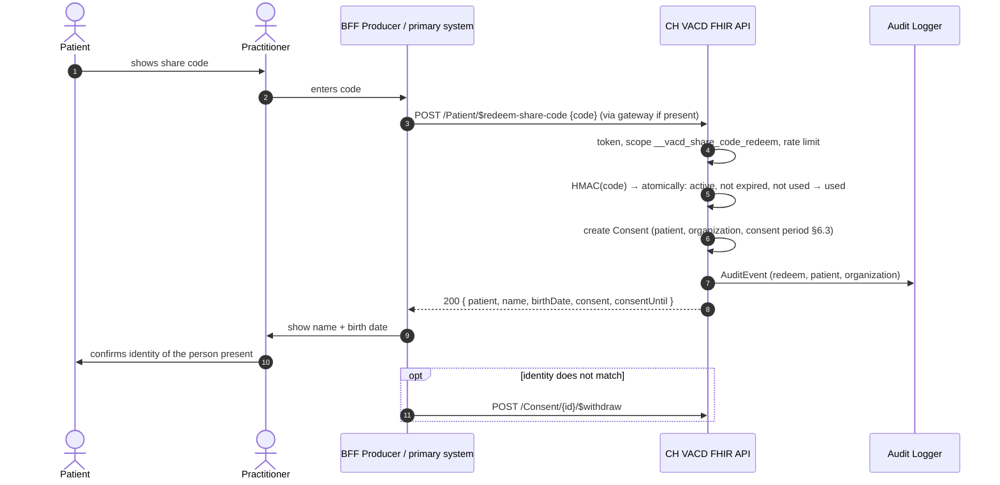
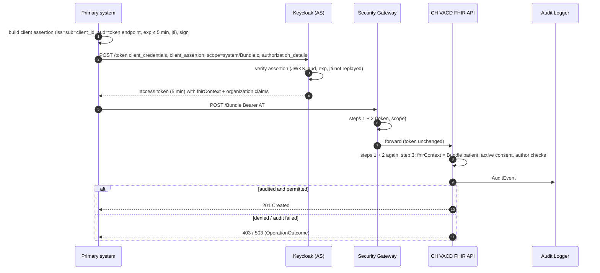

# Security Concept — Vaccination Domain POC

> **Status:** Draft. Target concept — describes how the platform *should*
> be secured, not how it is secured today.
> **Based on:** OAuth 2.0 / OpenID Connect, SMART App Launch v2, IHE IUA
> (claim pattern) and IHE BALP (audit).

This document is the reference the team orients on when building the
security of the Vaccination Domain POC. It states **what** must hold and
**why**. It deliberately does not track the current state or plan the
work:

| Document | Content |
| --- | --- |
| **This concept** | Protection needs, target architecture, access model, tokens, enforcement rules, audit, operations, threats, residual risks, acceptance criteria. Changes only when a design decision changes. |
| [Gap analysis](gap-analysis.md) | Dated snapshot of where the current code deviates from this concept (G1, G2, …). Changes with every fix. |
| [Implementation notes](implementation-notes.md) | Product-specific guidance: why Keycloak, how to configure it, which HAPI FHIR hooks to use, known limitations. |

**Wording.** **MUST** / **MUST NOT** mark binding rules, **SHOULD** marks
strong recommendations (RFC 2119 sense). Everything a rule depends on is
defined in this document; the [glossary](#15-glossary) explains terms.

**Related work.** The Swiss [UMZH-Connect](https://fhir.ch/ig/ch-umzh-connect/1.0.0-ballot/security.html)
IG (ballot) uses context-bound SMART tokens with `authorization_details`
and an organization claim for referral workflows. The M2M token structure
here follows the same pattern so that interoperability stays possible,
but this concept does not depend on it.

---

## Table of contents

1. [Scope and assumptions](#1-scope-and-assumptions)
2. [Protection needs](#2-protection-needs)
3. [Design principles](#3-design-principles)
4. [Architecture and trust zones](#4-architecture-and-trust-zones)
5. [Identity and authentication](#5-identity-and-authentication)
6. [Access model](#6-access-model)
7. [Tokens](#7-tokens)
8. [Enforcement](#8-enforcement)
9. [Audit and logging](#9-audit-and-logging)
10. [Infrastructure and operations](#10-infrastructure-and-operations)
11. [Threats and controls](#11-threats-and-controls)
12. [Accepted residual risks](#12-accepted-residual-risks)
13. [Acceptance criteria](#13-acceptance-criteria)
14. [Open questions](#14-open-questions)
15. [Glossary](#15-glossary)
16. [References](#16-references)

---

## 1. Scope and assumptions

### 1.1 In scope

- Access to the **CH VACD FHIR API** and, behind it, the openEHR CDR
  (EHRbase) and the mapping service (openFHIR).
- **Human access** through the consumer and producer frontends and their
  BFFs: patients and their representatives (consumer side),
  practitioners (producer side).
- **Machine-to-machine (M2M) access** by external primary systems
  (practice and pharmacy software) using SMART Backend Services.
- The **Authorization Server** (Keycloak), the **audit trail**
  (`audit-trace-logger`), and the operation of all of these components.

### 1.2 Out of scope

- Security of the primary systems themselves and of end-user devices.
- The external terminology server (`tx.fhir.ch`): only public value sets
  are sent to it, never patient data (§8.9).
- The Swiss electronic patient record (EPR / EPD). Alignment is an
  [open question](#14-open-questions).

### 1.3 Assumptions

| # | Assumption | If it does not hold |
| --- | --- | --- |
| A1 | The platform operator (who runs hosts, databases and Keycloak) is trusted; misuse by operators is limited by the controls in §10.3, not prevented. | Separation of duties and encryption with external key custody would be needed. |
| A2 | All services of the trust zone (§4.2) run on infrastructure the operator controls, connected by a private network. | Service-to-service traffic needs mTLS (§10.1). |
| A3 | Until the platform processes real data, only synthetic test data is used. | The regulatory steps of §2.3 become mandatory first. |
| A4 | Every organization (practice, pharmacy) has a GLN, and the operator can verify it against a registry when onboarding the organization. | Organization claims could not be trusted (§5.5). |
| A5 | Patients and representatives use a reasonably current browser on a device they control. | Proxy access (§6.6) is the fallback; see [open questions](#14-open-questions). |

### 1.4 Environments

| Environment | Meaning | Which rules apply |
| --- | --- | --- |
| **Development** | Open dev setup on a developer machine, synthetic data only | Only: published ports bound to `localhost`, no credentials of other environments, synthetic data only. Everything else may be missing. |
| **Secured deployment** | Secured setup (e.g. the `secure` compose profile), synthetic data | All rules of this concept, except those marked *before real data*. |
| **Real data** | Any environment holding real patient data | All rules, including those marked *before real data* and §2.3. |

Unless a rule names an environment, it applies to the secured
deployment and to real data.

---

## 2. Protection needs

### 2.1 Assets and data classification

| Asset | Examples | Classification |
| --- | --- | --- |
| Clinical data | Immunizations, vaccination record documents, allergies and conditions in the record | **Sensitive personal data** (health data) |
| Patient identity data | Name, birth date, gender, identifiers (incl. AHVN13 if ever stored) | Personal data; AHVN13 needs a legal basis |
| Authorization data | Consents, share codes, proxy relationships (`RelatedPerson`), identity attributes in Keycloak (`patient`, `organization_reference`, `gln`) | Security-critical — whoever can change them can reach clinical data |
| Credentials and keys | AS signing keys, client keys, passwords, database and EHRbase credentials, share-code HMAC key | Security-critical |
| Audit trail | `AuditEvent`s | Personal data; integrity-critical (evidence) |
| Directory data (registry, §4.1) | Organizations, practitioners, practitioner roles (GLN) | Low confidentiality, integrity-critical (used for author checks, consent display and `fhirUser` targets) |

### 2.2 Security objectives

| Objective | Meaning here | Priority |
| --- | --- | --- |
| **Confidentiality** | Clinical data reaches only the patient, their representatives, and organizations the patient released it to. | Highest |
| **Integrity** | Immunizations are recorded only for the right patient, by an identifiable organization, and never silently changed or deleted. | Highest (patient safety) |
| **Accountability** | Every access decision can be traced to a client, an organization and — for human flows — a person. | High |
| **Availability** | The record is available for treatment. Where availability conflicts with confidentiality or accountability, those win (fail closed, §9.2). | Medium for the POC |

### 2.3 Legal and regulatory basis

The POC uses synthetic data (A3). Before any real data is processed, the
following apply and **MUST** be addressed:

- **Swiss Federal Act on Data Protection (nDSG / revDSG):** health data is
  sensitive personal data (Art. 5 lit. c). Required: a data protection
  impact assessment (Art. 22), privacy by design and by default
  (Art. 7), data security measures (Art. 8), information and access
  rights of data subjects (Art. 19, 25), and reporting of data security
  breaches (Art. 24).
- **Data Protection Ordinance (DSV):** logging of automated processing of
  sensitive personal data and retention of these logs for at least one
  year, separate from the productive system (Art. 4); a processing
  policy (Art. 5).
- **AHVN13** may only be used systematically with a legal basis (AHVG
  Art. 50c ff.). The platform does not use it as an identifier.
- **EPR / EPDG** only if EPR interoperability becomes a goal
  ([open question](#14-open-questions)).

This assumes a controller under federal law. If the controller is a
cantonal body, cantonal data protection law (e.g. IDG ZH) applies
instead; naming the controller is an [open question](#14-open-questions).

---

## 3. Design principles

| Principle | Meaning for this project |
| --- | --- |
| **Standards first** | OAuth 2.0 / OpenID Connect, profiled by **SMART App Launch v2** (incl. Backend Services). No home-grown token formats. Deviations are listed in §7.5. |
| **Patient-controlled access** | An organization only gets access to a patient's data after an **action of the patient** — showing a share code, like handing over the paper vaccination booklet (§6.2). An organization cannot grant itself access. |
| **Patient-bound access** | Every request is checked against exactly one patient (§8.5). |
| **No patient lookup for organizations** | Practices and primary systems cannot search for patients; they learn a patient id only by redeeming a share code. |
| **Deny by default** | Every interaction not explicitly allowed in the authorization matrix (§8.4) is denied. |
| **AS / RS separation** | The Authorization Server authenticates and issues tokens; the FHIR API (Resource Server) decides whether *this* caller may touch *this* patient's data. The AS knows no clinical data. |
| **No shared secrets between parties** | Clients authenticate with `private_key_jwt`; tokens are signed asymmetrically and validated via JWKS. |
| **Tokens stay server-side** | Browsers never hold access or refresh tokens; the BFFs keep them in a server-side session. |
| **Identity provider is pluggable** | Human login happens at the AS. External identity providers can be brokered later without changing the tokens the platform sees. |
| **Defense in depth** | The gateway and the FHIR API both validate token and scope; the FHIR API also makes the fine-grained decision; backing stores are unreachable from outside. |
| **Audit is fail-closed** | No data leaves the FHIR API unless the access was audited (§9.2). |

---

## 4. Architecture and trust zones



### 4.1 Components and responsibilities

| Component | Responsibility |
| --- | --- |
| **Keycloak** (Authorization Server) | Authenticates users and clients; enforces the issuance policy (§5.3); issues SMART access tokens. Publishes JWKS. Knows no clinical data. |
| **BFF Producer / BFF Consumer** | Confidential OAuth clients. Hold tokens in a server-side session; the browser only gets a session cookie (§8.10). Never decide about access to patient data themselves. |
| **Primary system** | External M2M client (SMART Backend Services). |
| **Edge proxy** | TLS termination for browsers and primary systems; the only entry point next to the gateway. |
| **Security Gateway** | Steps 1 and 2 of §8 (token, scope), rate limiting, auditing its own denials. Forwards the token unchanged. Required as soon as M2M clients are connected. |
| **CH VACD FHIR API** (Resource Server, Policy Decision Point) | Steps 1–3 of §8. Owns consents, share codes and proxy relationships. Serves `/.well-known/smart-configuration`. Writes `AuditEvent`s. The only component that talks to openFHIR and EHRbase. |
| **openFHIR, EHRbase** | Mapping and clinical storage; reachable only from the FHIR API. |
| **Audit Trace Logger** | Append-only `AuditEvent` repository (§9). |
| **Registry** | Directory of organizations, practitioners and practitioner roles with their GLNs; source of `organization_reference` URLs, `fhirUser` targets (`PractitionerRole`), the organization name and GLN in `Consent.provision.actor.display`, and the GLNs used in author checks (§8.7). Run by the platform operator and written **only** by the operator during onboarding and offboarding (§5.5) — never through the FHIR API's client interface. The FHIR API reads it. Keycloak does not access it: the operator copies the organization claims into the client or account at onboarding. In the POC the registry **MAY** be a set of directory resources in the FHIR DB; the same rules apply. |

**Why the fine-grained decision lives in the FHIR API.** It needs FHIR
knowledge: looking up consents, resolving references inside document
Bundles, filtering responses. Putting that into the gateway would
duplicate FHIR logic outside the FHIR server. The gateway stays thin and
generic, and the FHIR API never relies on the gateway having checked
anything (§8.1).

### 4.2 Trust zones

| Zone | Contains | Reachable from |
| --- | --- | --- |
| Internet | Browsers, primary systems | — |
| DMZ | Edge proxy, Security Gateway | Internet (HTTPS only); BFFs (gateway) |
| Identity zone | Keycloak, its database | Edge proxy (authorization, token, end-session and login endpoints; no admin console); BFFs (token, end-session, JWKS for back-channel logout tokens); gateway, FHIR API and audit logger (JWKS); gateway and FHIR API (token endpoint, as service clients) |
| Application zone | BFFs | Edge proxy; Keycloak (back-channel logout) |
| Data zone | FHIR API, openFHIR, EHRbase, audit logger, registry, all databases | Gateway (FHIR API; audit logger for `POST /AuditEvent` only); FHIR API (everything else). In deployments without a gateway: BFFs (FHIR API only). |

No component of the data zone may be reachable from the internet. The
only outbound internet access is Keycloak fetching registered M2M JWKS
URLs (§5.5) and the FHIR API / BFFs calling the terminology server
(§8.9).

### 4.3 Roles with security duties

| Role | Duties |
| --- | --- |
| **Platform operator** | Runs the infrastructure; manages keys and secrets (§10.2); onboards and offboards organizations and M2M clients (§5.5); handles incidents (§10.5). |
| **Keycloak administrator** | Manages realm configuration, accounts and identity attributes. Admin actions are logged (§10.3). Uses a personal account with MFA. |
| **Onboarding officer** | Verifies identities when creating patient accounts and proxy relationships (§6.4, §6.6). |
| **Auditor** | Reads the audit trail; investigates denial spikes and incidents. Cannot change audit data. |
| **Development team** | Implements and tests the controls of this concept (§13); keeps the [gap analysis](gap-analysis.md) current. |

One person may hold several roles in the POC; in production, Keycloak
administration and auditing **SHOULD** be separated.

---

## 5. Identity and authentication

### 5.1 Human accounts

Humans log in at Keycloak (the AS) with **local Keycloak accounts**.
External identity providers (e.g. AGOV, HIN) can be brokered later; the
platform keeps seeing the same tokens.

| Account type | Realm role | Identity attributes (set by the onboarding officer / administrator) |
| --- | --- | --- |
| Patient | `patient` | `patient` = FHIR `Patient` id |
| Representative (parent, guardian) | `representative` | none — represented persons are stored as proxy relationships in the FHIR API (§6.6) |
| Practitioner | `practitioner` | `practitioner_role` = FHIR `PractitionerRole` id, `gln` (person), `organization_reference` + `organization_gln` (exactly one organization, see §14) |
| Administrator, auditor | `admin`, `auditor` | — (operator accounts, never patient data access through the BFFs) |

One account may hold several roles (e.g. a doctor who is also a patient, a
parent who is also a patient). Which role is active is determined by the
**client** the user logs in to (§5.3), never by the user.

Rules for local accounts:

- Password policy and brute-force detection **MUST** be enabled.
- MFA (TOTP or WebAuthn) **MUST** be enforced for practitioners,
  administrators and auditors. For patients and representatives it is
  optional in the POC and **MUST** become mandatory before real data is
  used.
- Test accounts and test passwords **MUST NOT** exist outside development
  environments.

### 5.2 Protected identity attributes

`patient`, `practitioner_role`, `gln`, `organization_reference`,
`organization_gln` — and every other attribute that ends up in a token,
such as the source of `fhirUser` — decide *whose* data a user can reach
and under which identity it is audited. If a user could edit them (e.g.
via the AS account console), a patient could set another patient's id.

- Every user attribute that is mapped into a token **MUST** be editable
  by administrators only.
- Users **MUST NOT** be able to add attributes of their own.
- The AS configuration (clients, scopes, flows, attribute definitions)
  **MUST** be versioned.

### 5.3 Token issuance policy

The AS decides who may log in where and what ends up in the token. The
FHIR API relies on this — it **MUST** be configured as follows:

| Client | Who may log in | Granted scopes (max.) | Identity claims in the token |
| --- | --- | --- | --- |
| `bff-consumer` | Accounts with role `patient` and/or `representative` | Patient: `openid fhirUser launch/patient patient/Patient.r patient/Immunization.rs patient/Consent.rs`. Representative: `openid user/Patient.r user/Immunization.rs user/Consent.rs`. Both: `__vacd_share_code_create`. | `patient`, `fhirUser` = `Patient/{id}` (only if role `patient`); `caller_type` = `consumer` |
| `bff-producer` | Accounts with role `practitioner` | `openid fhirUser user/Patient.r user/Immunization.rus user/Bundle.c __vacd_share_code_redeem` | `fhirUser` = `PractitionerRole/{id}`, `gln`, `organization_reference`, `organization_gln`; `caller_type` = `practitioner` |
| M2M client (one per primary system) | — (client credentials) | Subset of `system/Patient.r system/Immunization.rus system/Bundle.c __vacd_share_code_redeem`, fixed at onboarding | `organization_reference`, `organization_gln` (from onboarding); `fhirContext` (if requested, §6.7); `caller_type` = `system` |
| Service clients (`fhir-api`, `gateway`) | — (client credentials) | `system/AuditEvent.c` | `caller_type` = `service` |

- A login attempt at a client by an account without the required role
  **MUST** be refused by the AS (no token at all).
- User-facing clients **MUST** allow only the authorization code flow
  with PKCE — no password grant, no implicit flow — so the role check
  cannot be bypassed.
- At `bff-consumer`, `patient/` scopes and `launch/patient` are granted
  only to accounts with role `patient`, `user/` scopes only to accounts
  with role `representative`.
- Claims are **client-specific**: tokens for `bff-consumer` **MUST NOT**
  contain organization claims, and tokens for `bff-producer` **MUST NOT**
  contain a `patient` claim — even if the account holds both roles.
- `caller_type` is set by the AS per client and is **authoritative**; the
  client cannot choose it.
- A client **MUST NOT** receive scopes outside its row, regardless of what
  it requests. No client receives `Consent.c`, `RelatedPerson.*`, any
  `.d` (delete) scope, or `Patient.s`.

### 5.4 Account lifecycle

| Event | Rule |
| --- | --- |
| Creation | Patient accounts are created only by patient onboarding (§6.4); practitioner accounts by the administrator after verifying the person's GLN and organization; representative accounts with the proxy relationship (§6.6). Self-registration is disabled. |
| Password reset | Self-service reset via e-mail is acceptable for the POC. Before real data, the reset channel **MUST** be at least as strong as the login (e.g. MFA required after reset). |
| MFA reset | Only by an administrator after an identity check; logged. |
| Deprovisioning | When a practitioner leaves an organization or a custody relationship ends, the account (or attribute, or `RelatedPerson`) **MUST** be deactivated the same day; open sessions are revoked (§8.10). |
| Session revocation | Deprovisioning **MUST** both disable the account and explicitly log out all its sessions at the AS, which triggers back-channel logout to the BFFs. Disabling alone is not relied on to end sessions. At most one access-token lifetime remains (§7.4). |

### 5.5 M2M client onboarding and offboarding

Onboarding is a one-time, out-of-band process run by the platform
operator:

1. The organization proves its identity and GLN (verified against an
   external GLN registry, assumption A4) and names a responsible contact.
   The operator creates or updates its entry in the platform registry
   (§4.1); `organization_reference` is the URL of that entry.
2. It registers a **JWKS URL** (preferred, enables key rotation) or a
   public key. JWKS URLs **MUST** use HTTPS, resolve to public addresses,
   and be fetched by the AS through an egress path that cannot reach
   internal networks (SSRF protection).
3. The operator creates the client with `private_key_jwt` authentication,
   the allowed `system/` scopes, and the organization claims. Because the
   AS owns this mapping, the organization claim is authoritative.

Offboarding or compromise: the client is disabled and its key or JWKS URL
removed; tokens die after their lifetime (§7.4). Each organization
**MUST** report key compromise without delay.

---

## 6. Access model

### 6.1 Scenarios

| # | Scenario | Caller type | Patient comes from | Access rule (§8.6) |
| --- | --- | --- | --- | --- |
| S0 | Patient or representative issues a share code | consumer | `patient` claim, or child selected in the app | own patient, or active proxy relationship |
| S1 | Patient reads own vaccination record | consumer | `patient` claim | own patient |
| S2 | Practice or primary system redeems a share code | practitioner, system | the share code | code valid |
| S3 | Practitioner records or corrects an immunization | practitioner | request (patient id from S2) | active consent for the organization |
| S4 | Primary system submits an Immunization Administration Document | system | request + `fhirContext` | `fhirContext` = request patient, active consent |
| S5 | Primary system reads the vaccination record | system | request + `fhirContext` | `fhirContext` = request patient, active consent |
| S6 | Representative reads a represented person's record | consumer | child selected in the app | active proxy relationship |

### 6.2 Share code

**Why.** The AS does not check whether a caller may access a particular
patient (AS / RS separation), so all practitioner and M2M access rests on
the **consent** the FHIR API checks. If an organization could create that
consent itself, the check would be worthless. A consent is therefore
created **only by an action of the patient**: the patient shows a share
code, the organization redeems it. The idea is inspired by SMART Health
Links.

**Issuing (S0).** The patient — or a representative for a represented
person — displays a short code (e.g. `K7QM-4XJ2-PV9R`) in the consumer
app; the practitioner types it into the producer frontend or primary
system.

- The code **MUST** be an opaque random value with no personal data:
  12 characters of Crockford Base32, shown in groups of four (60 bit).
- It is valid for **10 minutes** and **single use**. A new code issued
  by the same account for the same patient invalidates its unused
  predecessor; codes issued by different accounts (e.g. both parents) do
  not affect each other.
- The FHIR API **MUST** store only a keyed hash (HMAC) of the code, with
  patient, issuing account, expiry and status (active / used / expired).
- The code is only shown in the app; the platform never sends it by
  e-mail or SMS.

**Redeeming (S2).**



- Checking and consuming the code **MUST** be one atomic state
  transition: concurrent redemptions of the same code yield exactly one
  success.
- The response returns the patient id plus **minimal identification
  data** (name, birth date). The practitioner **MUST** confirm that they
  match the person present before recording anything; the producer
  frontend **MUST** enforce this confirmation step. Primary systems
  **MUST** compare them with their local patient record.
- If the identity does not match, the organization **MUST** withdraw the
  consent it just received (`$withdraw`, §8.4). The API sets it inactive,
  audits it, and the consumer app shows it as withdrawn.
- Redemption is the **only** way an organization learns a patient id.
- Invalid, expired and already used codes all give the same response
  (`403`).
- Redemption **MUST** be rate-limited per organization, per client and
  globally. The per-organization limit counts **failed** attempts
  (default: 10 per minute); a separate, higher limit applies to all
  attempts, so that busy sites (e.g. mass vaccination) are not blocked by
  successful redemptions. All limits are configurable; their values
  **MUST** be set from the expected peak load and documented. These
  limits are enforced by the FHIR API, which knows the organization and
  the outcome; a gateway may add coarse limits in front. Failed attempts
  are audited and alerted on (§10.5).
- The consumer app **MUST** show which organization redeemed the code,
  list all active consents, and let the patient — or a representative
  with an active proxy relationship — **withdraw** any of them
  (`$withdraw`, §8.4). This lets the patient react to an unwanted
  redemption (R1).

**Why 60 bit is enough.** A code lives 10 minutes, is single use, can
only be redeemed with an organization token, and redemption is
rate-limited. With 10 000 codes active at the same time, the chance per
guess is about 10⁻¹⁴; at 10 guesses per minute an organization reaches
about 5·10⁻⁸ per year. The realistic risk is not guessing but disclosure
(shoulder surfing, phishing calls) — see §11 and §12.

### 6.3 Consent

A redeemed share code creates a FHIR R4 `Consent`:

| Element | Value |
| --- | --- |
| `status` | `active` |
| `scope` | `http://terminology.hl7.org/CodeSystem/consentscope#patient-privacy` |
| `category` | `http://loinc.org#59284-0` (patient consent) |
| `patient` | the patient of the share code |
| `dateTime` | redemption time |
| `policyRule` | `http://terminology.hl7.org/CodeSystem/v3-ActCode#OPTIN` |
| `provision.type` | `permit` |
| `provision.period` | redemption time until the **later** of 23:59:59 Europe/Zurich of the redemption day and redemption time + **4 hours** (minimum window, configurable) |
| `provision.actor` | role `http://terminology.hl7.org/CodeSystem/v3-ParticipationType#PRCP`, reference = the redeeming organization (`organization_reference`), `display` = organization name and GLN taken from the registry (never from the token or the request) |
| `identifier` | platform system URI + id of the internal share-code record (never the code) |

- An **active consent** is a `Consent` with all of the above and a
  `provision.period` covering the current time.
- Consents are created **only** by `$redeem-share-code`. No client gets
  `Consent.c`; consents are never updated or deleted by clients. The only
  change a client can make is `$withdraw` — by the organization the
  consent was granted to, or by the patient or a representative with an
  active proxy relationship (§6.2).
- A consent covers **the organization** — every practitioner and every
  M2M client of that organization — for **reading the record and
  submitting documents**. "Organization" means the site with its own GLN,
  not a group or chain.
- **One code per visit.** Every later visit, also within a vaccination
  series, needs a new code.
- The patient (or a representative) can end a consent early with
  `$withdraw`; the organization loses access with its next request. Data
  the organization has already read stays with it (R8).

### 6.4 Patient identification and onboarding

- Organizations **MUST NOT** be able to search for patients — not even
  with an exact name and birth date, which would reveal whether a person
  is registered. They get a patient id only from a share code. Primary
  systems may store it locally to match later visits (a new consent is
  still needed); the producer frontend and BFF keep no patient lists
  (§8.10).
- New `Patient` resources are created **only by patient onboarding** —
  never implicitly by a document, a read, or a `PUT` (no upsert). How
  onboarding works is an [open question](#14-open-questions); it **MUST**
  include an identity check by an onboarding officer or an equivalent
  electronic identification.
- Patient master data (name, birth date) is changed only through
  onboarding / account management, never by submitted documents.

### 6.5 Recording and correcting immunizations

**Recording (S3, S4).** Immunizations are recorded **only** as
Immunization Administration Documents (`POST /Bundle`). Single
`Immunization` resources cannot be created directly. Rules: §8.7.

**Historical immunizations.** Transcribing past vaccinations from the
paper booklet is a core use case. Such entries have
`primarySource = false`; their performer may be another organization and
is claimed, not verified. The document author is still the recording
practitioner, and the platform records which organization entered them
(§8.7). Every read path **MUST** show the recording organization next to
entries with `primarySource = false`, so readers can tell a transcribed
entry from a first-hand one.

**Corrections.** A wrong entry is corrected by setting its status to
`entered-in-error` — never by deleting or rewriting it. Corrections use
the dedicated operation `POST /Immunization/{id}/$mark-entered-in-error`,
whose only input is a reason (`statusReason`). There is no
`PUT /Immunization/{id}`: a full-body update would have to be compared
with a stored resource that comes back through openFHIR, and that round
trip is not guaranteed to be lossless.

- Only the organization that **recorded** the entry may correct it —
  through a practitioner or one of its primary systems (M2M). The
  recording organization is stored by the FHIR API at creation time; it
  is not taken from `Immunization.performer`.
- The operation changes only `status` (to `entered-in-error`) and
  `statusReason`; clients cannot send any other element.
- The previous version **MUST** be preserved in storage (CDR
  versioning: a new version of the affected composition, not a
  deletion) and available to auditors and operators for
  investigations; it is not exposed to clients through the API. The
  correction **MUST** be visible in every read path (`GET /Immunization`
  and documents built from the CDR such as `$export-document`).
- A correction needs an active consent like any other access (see §14
  for a possible grace period).

### 6.6 Proxy access (children and represented persons)

Vaccinations mostly happen in childhood, so acting for someone else is the
normal case. The FHIR API stores who may act for whom as `RelatedPerson`:

| Element | Content |
| --- | --- |
| `patient` | the represented person |
| `relationship` | e.g. parent, guardian (HL7 RoleCode) |
| `identifier` | `system` = AS issuer URL, `value` = the representative's account id (`sub`). Account ids **MUST** stay stable across AS re-deployments. |
| `period` | start; end at the latest on the 18th birthday |
| `active` | `false` when revoked (change of custody, the child takes over) |

- Proxy relationships are created and changed **only by the onboarding
  process** with an identity check — never through the API by clients.
- Several representatives per person and several persons per
  representative are possible.
- A representative may **list the persons they represent**, **read** a
  represented person's record, **issue share codes** for them, **see
  their active consents** and **withdraw** them — nothing else.
- The list comes from `GET /$represented-persons` (§8.4). It returns only
  the active relationships of the calling account (identified by token
  issuer and `sub`, never by request parameters): patient reference,
  name and relationship. Generic `RelatedPerson` or `Patient` searches
  stay denied.
- Transition to the child's own account (capacity of judgment,
  *Urteilsfähigkeit*): [open question](#14-open-questions).

### 6.7 Machine-to-machine (S4, S5)

The primary system first redeems a share code (S2) with a token **without
patient context**. Apart from terminology calls, that token is valid for
`$redeem-share-code` and `$withdraw` only. For data access it then
requests a **patient-bound token** with `authorization_details`
(RFC 9396) — exactly one `ch-vacd-context` entry with exactly one
patient; malformed requests yield a token without `fhirContext`:

```json
"authorization_details": [{
  "type": "ch-vacd-context",
  "identifier": "Patient/5f1c2e0a-...",
  "purpose_of_use": "TREAT"
}]
```

- The AS copies the patient into the `fhirContext` claim. It does **not**
  check whether the client may access that patient — the FHIR API does
  (consent, §8.6). The binding limits a leaked token to one patient for
  its short lifetime; it does not grant access by itself.
- `purpose_of_use` (HL7 v3 PurposeOfUse) is **claimed by the client and
  not verified**. It is recorded in the audit and **never** used for an
  authorization decision.



**Accountability.** An M2M submission identifies the organization, not a
person. The `Composition.author` of a submitted document names the
practitioner (by GLN); this is **claimed by the primary system** and
recorded as such (§12).

### 6.8 Emergency access

Emergency access (break-glass) is **not supported**. No caller can reach a
patient without an active consent or proxy relationship.

---

## 7. Tokens

### 7.1 Scopes

SMART v2 scope syntax: `<context>/<Resource>.<permissions>` (§15.2).
The share-code operations have no SMART equivalent and use custom
scopes; SMART requires custom scopes to be full URIs or to start with
`__`.

| Scope | Meaning |
| --- | --- |
| `__vacd_share_code_create` | Call `$create-share-code`, and `$withdraw` on consents of a patient the caller may issue codes for (consumer only) |
| `__vacd_share_code_redeem` | Call `$redeem-share-code` — which creates the consent and returns the minimal identification data of §6.2 — and `$withdraw` on a consent received that way (practitioner, system) |

These scopes cover everything their operations do; no additional
`Consent` or `Patient` scope is needed or granted. Which client may
receive which scopes: §5.3.

### 7.2 Access token claims

All access tokens are JWTs (RFC 9068 structure) signed by the AS.

**Patient (via `bff-consumer`):**

```json
{
  "iss": "https://auth.vacd.example.ch/realms/vacd",
  "sub": "c0a8f5d2-...",
  "aud": "https://api.vacd.example.ch/fhir",
  "azp": "bff-consumer",
  "iat": 1790000000,
  "exp": 1790000300,
  "jti": "7d1e...",
  "scope": "openid fhirUser launch/patient patient/Patient.r patient/Immunization.rs patient/Consent.rs __vacd_share_code_create",
  "patient": "5f1c2e0a-...",
  "fhirUser": "Patient/5f1c2e0a-...",
  "extensions": { "ch_vacd": { "caller_type": "consumer" } }
}
```

A representative who is not a patient gets `user/` scopes instead of the
`patient/` scopes and `launch/patient`, and no `patient` or `fhirUser`
claim. An account that is both gets both.

**Practitioner (via `bff-producer`)** — no patient context; the patient
comes from the request and consent is checked per request:

```json
{
  "iss": "https://auth.vacd.example.ch/realms/vacd",
  "sub": "1b2c3d4e-...",
  "aud": "https://api.vacd.example.ch/fhir",
  "azp": "bff-producer",
  "iat": 1790000000,
  "exp": 1790000300,
  "jti": "2a9c...",
  "scope": "openid fhirUser user/Patient.r user/Immunization.rus user/Bundle.c __vacd_share_code_redeem",
  "fhirUser": "PractitionerRole/pr-123",
  "extensions": {
    "ch_vacd": {
      "caller_type": "practitioner",
      "gln": "7601000000001",
      "organization_reference": "https://registry.vacd.example.ch/fhir/Organization/org-42",
      "organization_gln": "7601000000000"
    }
  }
}
```

**M2M (S4/S5):**

```json
{
  "iss": "https://auth.vacd.example.ch/realms/vacd",
  "sub": "praxis-muster-sw",
  "aud": "https://api.vacd.example.ch/fhir",
  "azp": "praxis-muster-sw",
  "iat": 1790000000,
  "exp": 1790000300,
  "jti": "5a8e...",
  "scope": "system/Bundle.c system/Patient.r system/Immunization.rs",
  "fhirContext": [{ "reference": "Patient/5f1c2e0a-..." }],
  "authorization_details": [{
    "type": "ch-vacd-context",
    "identifier": "Patient/5f1c2e0a-...",
    "purpose_of_use": "TREAT"
  }],
  "extensions": {
    "ch_vacd": {
      "caller_type": "system",
      "organization_reference": "https://registry.vacd.example.ch/fhir/Organization/org-42",
      "organization_gln": "7601000000000"
    }
  }
}
```

The redemption token (S2) is the same without `fhirContext` and
`authorization_details`, with scope `__vacd_share_code_redeem`.

### 7.3 Client authentication

All confidential clients (BFFs, M2M clients, service clients)
authenticate at the token endpoint with `private_key_jwt` (RFC 7523,
SMART Backend Services):

```json
{
  "iss": "praxis-muster-sw",
  "sub": "praxis-muster-sw",
  "aud": "https://auth.vacd.example.ch/realms/vacd/protocol/openid-connect/token",
  "exp": 1790000300,
  "iat": 1790000000,
  "jti": "b3f1c2e4-7d7a-4f6c-9e0a-2d1c5a9e8f11"
}
```

JOSE header: `alg` RS384 or ES384, `kid` matching a key in the client's
registered JWKS, `typ` `JWT`. Payload: `exp` at most 5 minutes after
`iat`; `jti` single use; `aud` = token endpoint.

### 7.4 Lifetimes and algorithms

| Item | Value |
| --- | --- |
| Access token | 5 min (M2M, service), 5–10 min (user) |
| Refresh token | User flows only, held in the BFF session, rotated on use |
| BFF session | Idle timeout 30 min, absolute timeout 8 h |
| Share code | 10 min, single use |
| Consent from a redeemed code | Until the later of 23:59:59 Europe/Zurich of the redemption day and redemption + 4 h (§6.3) |
| Access-token signature (AS) | RS256 or ES256 — the allow-list for step 1 (§8.2) |
| Client-assertion signature | RS384 or ES384 |
| AS signing keys | Rotated regularly; validators cache JWKS and refetch on unknown `kid` |

### 7.5 Divergences from SMART

- For M2M, `fhirContext` is a **claim inside the JWT**, not only a
  token-response parameter, so the FHIR API can decide without an
  introspection call. The same holds for `patient` in user tokens.
- Organization and caller-type claims follow the IHE IUA
  `extensions.<name>` pattern (`extensions.ch_vacd`).
- The share-code operations use custom scopes (§7.1).
- `Bundle.c` on `POST /Bundle` means submitting an Immunization
  Administration Document, which creates immunizations and compositions
  on the server. `Immunization.c` is deliberately not granted (§6.5).
- `Immunization.u` permits only `$mark-entered-in-error` (§6.5); there is
  no `PUT` on `Immunization`.
- RFC 9068 names the client `client_id`; the AS may emit `azp` instead.
  The RS treats `azp` as the client id.
- `/.well-known/smart-configuration` is served by the FHIR API (SMART
  requires it at the FHIR base URL), pointing to the AS endpoints.

---

## 8. Enforcement

### 8.1 Three steps, two layers

| Step | Checks | Gateway | FHIR API |
| --- | --- | --- | --- |
| 1 — Authentication | Token signature, type, issuer, audience, lifetime (§8.2) | ✓ | ✓ |
| 2 — Scope | Scope required for the interaction (§8.4) | ✓ | ✓ |
| 3 — Access decision | Caller type, patient, consent / proxy relationship, write rules, response check (§8.3–§8.9) | — | ✓ |

The FHIR API **MUST** perform all three steps itself and **MUST NOT**
rely on the gateway; the gateway adds rate limiting and an early
rejection layer. EHRbase, openFHIR and the databases are reachable only
from the FHIR API, and the audit logger only from the FHIR API and the
gateway (§4.2). The audit logger enforces its own rules (§9.4).

### 8.2 Step 1 — Token validation

- `Authorization: Bearer` present, JWT well-formed.
- Signature valid against the AS JWKS; `alg` from the allow-list in §7.4
  (never `none`, never `HS*`).
- Token type is an access token: JOSE header `typ` = `at+jwt`
  (RFC 9068). ID tokens and other JWTs from the same AS are rejected.
- `iss` = the realm; `aud` contains the FHIR API base URL; `exp` / `nbf`
  valid with small clock skew; `azp` is a known client.
- If token binding is enabled (DPoP or mTLS, §10.1): the `cnf` binding
  matches.

Failure → `401` with `WWW-Authenticate: Bearer error="invalid_token"`.

### 8.3 Caller type

The FHIR API determines the caller type **only** from the
`extensions.ch_vacd.caller_type` claim (§5.3) and checks that the token is
consistent with it:

| Caller type | Allowed resource-scope contexts | Required claims | Must not contain |
| --- | --- | --- | --- |
| `consumer` | `patient/`, `user/` | `patient` if any `patient/` scope; if `fhirUser` is present, it equals `Patient/{patient}` | organization claims, `fhirContext` |
| `practitioner` | `user/` | `fhirUser`, `gln`, `organization_reference`, `organization_gln` | `patient`, `fhirContext` |
| `system` | `system/` | `organization_reference`, `organization_gln` | `patient` |
| `service` | `system/AuditEvent.c` only | — | patient or organization claims |

Non-resource scopes (`openid`, `fhirUser`, `launch/patient`, the custom
scopes of §7.1) are allowed only as granted per client in §5.3. An
inconsistent token or an unknown caller type is rejected (`403`).

### 8.4 Authorization matrix (default deny)

Every interaction not listed here **MUST** be denied, including `DELETE`
on any resource, `_history`, batch/transaction Bundles, and every
resource type not listed (e.g. `RelatedPerson`, `Organization`,
`Practitioner`, `PractitionerRole`, `List`, `Binary`).

| Interaction | consumer | practitioner | system | Required scope (any of, matching the caller's context) |
| --- | --- | --- | --- | --- |
| `GET /metadata`, `GET /.well-known/smart-configuration` | public | public | public | none |
| `GET /Patient/{id}` | ✓ | ✓ | ✓ | `*/Patient.r` |
| `POST /Patient/{id}/$export-document` (vaccination record) | ✓ | ✓ | ✓ | `*/Patient.r` **and** `*/Immunization.r` |
| `GET /Immunization/{id}` | ✓ | ✓ | ✓ | `*/Immunization.r` |
| `GET /Immunization?patient=` (patient mandatory) | ✓ | ✓ | ✓ | `*/Immunization.s` |
| `POST /Bundle` (Immunization Administration Document) | — | ✓ | ✓ | `user/Bundle.c`, `system/Bundle.c` |
| `POST /Immunization/{id}/$mark-entered-in-error` (correction, §6.5) | — | ✓ | ✓ | `user/Immunization.u`, `system/Immunization.u` |
| `POST /Patient/{id}/$create-share-code` | ✓ | — | — | `__vacd_share_code_create` |
| `POST /Patient/$redeem-share-code` | — | ✓ | ✓ | `__vacd_share_code_redeem` |
| `POST /Consent/{id}/$withdraw` (consumer: consent of the own or a represented patient; practitioner, system: consent granted to the caller's organization) | ✓ | ✓ | ✓ | `__vacd_share_code_create` (consumer), `__vacd_share_code_redeem` (practitioner, system) |
| `GET /Consent?patient=` | ✓ | — | — | `patient/Consent.s`, `user/Consent.s` |
| `GET /$represented-persons` (§6.6) | ✓ | — | — | `user/Patient.r` |
| `GET /ValueSet`, `GET /ValueSet/{id}`, `POST /ValueSet/{id}/$expand` | ✓ | ✓ | ✓ | any valid token (no patient data) |

The audit logger is a separate server with its own rules (§9.4).

Not allowed for any client: patient search (`GET /Patient?…`), creating
or updating patients (onboarding only, §6.4), `POST /Immunization`,
`PUT /Immunization/{id}` (corrections use `$mark-entered-in-error`, §6.5).

Rules for adding interactions:

- A new operation or route gets a row **before** it is exposed.
- An operation **MUST** require the resource scopes for the clinical data
  it returns or changes, or a custom scope whose meaning is defined in
  §7.1. For the vaccination record, the row's scopes also cover the
  document's `Composition`, `AllergyIntolerance` and `Condition` entries
  and the shared resources inside it (directory entries, `Medication`).
- Operations are not covered by generic compartment logic; each needs an
  explicit rule in §8.6.

Failure → `403` (`OperationOutcome`, `insufficient_scope`).

### 8.5 Determining the request patient

Every request (except public, terminology, redemption and
`$represented-persons` calls) addresses
**exactly one** patient, determined in a single canonical way. The access
check and the request handler **MUST** use the same resolution logic.

| Request | Patient |
| --- | --- |
| `/Patient/{id}…` | path id |
| `?patient=` | exactly one value, `{id}` or `Patient/{id}`. Absolute URLs, chained parameters (`patient.identifier=…`), modifiers and repeated parameters are rejected. Searches without `patient` are rejected. |
| `GET /Immunization/{id}`, `$mark-entered-in-error` | `Immunization.patient` of the **stored** resource |
| `POST /Bundle` | `Composition.subject` and the patient / subject reference of **every** entry that has one — resolved inside the Bundle (`urn:uuid` full URLs) — **MUST** all point to the same `Patient` entry, which **MUST** carry the id of an existing patient |
| `$create-share-code` | path id |
| `$redeem-share-code` | the patient of the share code |
| `$withdraw` | `Consent.patient` of the stored consent |
| `$represented-persons` | none — the result is limited to the caller's own relationships |

A missing patient and a patient without access give the same response
(`403`); the API **MUST NOT** fabricate resources for unknown ids.

### 8.6 Access rules per caller type

| Caller | Rule |
| --- | --- |
| consumer, own patient | Token has `patient/` scopes and `token.patient` = request patient. |
| consumer, representative | Token has `user/` scopes and an active `RelatedPerson` exists for (request patient, issuer + `sub`) with `period` covering now. |
| consumer, both fail | Deny (except the interactions without a request patient below). A consumer may never write clinical data; `$withdraw` on a consent of the own or a represented patient is the only change a consumer can make to authorization data. |
| any, no request patient | Public and terminology rows of §8.4: no patient check. `$represented-persons`: consumer with `user/Patient.r`; the result is limited to active `RelatedPerson`s of the token's issuer and `sub` (§6.6). |
| practitioner | Active consent for (request patient, `organization_reference`). Exceptions: `$redeem-share-code`; `$withdraw` (consent granted to the caller's organization, active or not). |
| system | `fhirContext` contains exactly one patient, equal to the request patient, **and** active consent for (request patient, `organization_reference`). Exceptions as for practitioner — the only patient-data interactions allowed without `fhirContext`. |
| service | No FHIR API access; only `POST /AuditEvent` at the audit logger (§9.4). |

### 8.7 Write rules

For `POST /Bundle` (Immunization Administration Document), in addition to
§8.5 and §8.6:

- The Bundle **MUST** validate against the CH VACD profile; validation
  errors (severity *error* or worse) reject the request.
- The patient **MUST** exist; no implicit creation (§6.4). Patient
  demographics in the Bundle **MUST NOT** change the stored patient. The
  `Patient` entry's birth date **MUST** equal the stored one (otherwise
  `422`), as a server-side guard against wrong-patient submissions.
- **Author:** `Composition.author` **MUST** identify the caller —
  practitioner GLN = token `gln` (practitioner flows) and organization GLN
  = token `organization_gln` (all flows). Comparison is by **identifier**
  (GLN, system `urn:oid:2.51.1.3`), never by resource id or `urn:uuid`.
- **Performer:** for `primarySource = true`, the performing organization
  **MUST** be the caller's organization. For `primarySource = false`
  (historical entries), the performer is free text / any organization.
- `Practitioner`, `PractitionerRole` and `Organization` entries in a
  Bundle **MUST NOT** be persisted as directory data; directory data comes
  only from the registry maintained by the operator (§4.1).
- The FHIR API stores the **recording organization** (from the token)
  with every created immunization; it is the basis for corrections.
- **All or nothing:** a document is stored completely or not at all. If
  it maps to several openEHR compositions and EHRbase cannot store them
  in one transaction, the FHIR API **MUST** remove the compositions
  already created when a later one fails (compensation) and return an
  error. The outcome `AuditEvent` records the failure and the
  compensation (§9.2); if the compensation fails, an alert is raised
  (§10.5) and the remaining compositions are listed in the outcome
  `AuditEvent`, so the partial state is visible.

For `POST /Immunization/{id}/$mark-entered-in-error` (correction): only
by the recording organization; only `status` → `entered-in-error` and
`statusReason` change; active consent required (§6.5).

### 8.8 Response check

Every resource returned **MUST** belong to the request patient:
`Patient` (the patient itself), `Immunization`, `Composition`,
`AllergyIntolerance`, `Condition` and other clinical resources via their
patient / subject reference, `Consent` via `Consent.patient`. Shared resources without a patient
reference (`Practitioner`, `PractitionerRole`, `Organization`,
`Medication`, `Location`) may be returned **only** as entries of a
document for that patient that are referenced from a patient-bound
entry. These types are not part of FHIR's Patient compartment, so a plain
compartment check is not sufficient; the rule must be implemented
explicitly. A response containing anything else is withheld (`403`).

Responses of `$create-share-code` (the code and its expiry),
`$redeem-share-code` (§6.2), `$withdraw` (the updated consent or an
`OperationOutcome`) and `$represented-persons` (§6.6) are defined by
their operations and contain only the data listed there.

### 8.9 Input handling and error responses

- Accepted content: FHIR JSON (and XML only if needed) with size limits
  on request bodies and on the number of Bundle entries.
- Error responses (`OperationOutcome`) **MUST NOT** contain stack traces,
  internal URLs, resource ids of other patients, or the reason for a
  consent denial.
- Calls to the external terminology server **MUST** contain only value
  set and code data, never patient data.

### 8.10 BFF requirements

Tokens never reach the browser; there is no interim solution with bearer
tokens in the browser.

- **Login:** Authorization Code with PKCE; the BFF authenticates with
  `private_key_jwt`. The session id **MUST** be renewed after login.
- **Session cookie:** `HttpOnly`, `Secure`, `SameSite=Lax` or stricter,
  `__Host-` prefix. Tokens are stored only in the server-side session.
- **Timeouts:** idle and absolute timeouts as in §7.4.
- **Logout:** RP-initiated logout at the AS, back-channel logout from the
  AS, and revocation of the refresh token.
- **CSRF:** a CSRF token plus `Origin` check for every state-changing
  endpoint. `SameSite` alone is not sufficient.
- **XSS:** a strict Content Security Policy (no inline scripts) and
  output encoding. All text from FHIR resources (names, notes, lot
  numbers) is untrusted, because it can come from other organizations.
- **No identity from the browser:** the consumer BFF takes the patient
  from the token or from the list of represented persons; the producer
  BFF takes the patient id from a redemption. No valid session means a
  redirect to the login — never a fallback patient.
- The BFFs **MUST NOT** expose functions the FHIR API denies (e.g.
  patient lists, payload logs).

---

## 9. Audit and logging

### 9.1 What is audited

| Event | Audited by | Record |
| --- | --- | --- |
| Every request with a valid token — permitted or denied | FHIR API | `AuditEvent` |
| Requests the gateway rejects in step 2 | Gateway | `AuditEvent` |
| Requests without a valid token (step 1 failures) | Gateway / FHIR API | Counter + application log (no `AuditEvent`, to prevent unauthenticated flooding of the audit store) |
| Share-code issue and redemption (success and failure) | FHIR API | `AuditEvent` (never the code itself) |
| Keycloak logins, failed logins, admin actions | Keycloak | Keycloak events (§10.3) |

### 9.2 Fail-closed

- **Reads:** the `AuditEvent` is written before the response is released.
  If it cannot be written, the request fails (`503`) and no data leaves
  the FHIR API.
- **Writes:** an `AuditEvent` with the intended action is written before
  the change; if that fails, the change is not executed (`503`). After
  the change, a second `AuditEvent` records the outcome, correlated via a
  request id. If the outcome event cannot be written, an alert is raised
  (§10.5). A failed write records whether it was fully rolled back or
  compensated (§8.7).
- Fail-closed means an audit outage stops the platform. This is
  intended (§2.2) and listed in §12.

### 9.3 AuditEvent content (IHE BALP)

| Element | Content |
| --- | --- |
| `type` / `subtype` | `rest` / FHIR interaction (`read`, `search-type`, `create`, `update`, `operation`) |
| `action` | `C` create, `R` read, `U` update, `E` search and operations |
| `outcome` / `outcomeDesc` | `0` success, `4` denied, `8` error / denial reason (no personal data) |
| `recorded` | timestamp |
| `source` | the auditing component (FHIR API or gateway) |
| `agent` (client) | `azp` / client id, network address; for M2M flows also `policy` = token `jti` and `purposeOfUse` = `purpose_of_use` as **claimed by the client** |
| `agent` (user) | human flows only: `fhirUser` or `sub`; `policy` = token `jti` |
| `agent` (organization) | `organization_reference` |
| `agent` (representative) | the `RelatedPerson`, for proxy access |
| `entity` (patient) | request patient |
| `entity` (data) | requested resource or query; for share codes the consent id |

Audit entries contain references, not clinical content.

### 9.4 Protection of the audit trail

- **Append-only:** the audit logger accepts no `update` or `delete` on
  `AuditEvent`. The audit store **MUST NOT** share a database instance or
  credentials with any other service; no credential held by another
  service may modify it, and the logger's own database role has `INSERT`
  and `SELECT` rights only.
- **Enforcement at the audit logger:** it validates tokens like §8.2,
  with its own audience. `POST /AuditEvent` requires caller type
  `service` and `system/AuditEvent.c`. Every other HTTP interaction is
  denied — including read and search, for every token.
- **Read access** for auditors only, through operator tooling with a
  read-only database role. An HTTP read path (e.g. for an audit console
  or a patient-facing access log) needs its own client, caller type and
  rules in this concept first.
- **Retention:** at least one year (DSV Art. 4), stored separately from
  the productive data; the final period is an open question (§14).

### 9.5 Application logs

- Application logs **MUST NOT** contain clinical payloads, tokens, share
  codes or passwords outside development environments with synthetic
  data.
- Stores that keep full request or response payloads for debugging
  **MUST NOT** exist outside development environments.

---

## 10. Infrastructure and operations

### 10.1 Network exposure and transport security

- Only the edge proxy and the gateway are published; every other port is
  internal (§4.2). Development setups bind published ports to
  `localhost` only.
- The Keycloak admin console and admin API are **not** reachable through
  the edge proxy.
- All traffic that leaves a host uses TLS. Plain HTTP is acceptable only
  on `localhost` in development; `Secure` cookies and the login flow
  otherwise require HTTPS.
- Inside the data zone, a private network is required (A2); mTLS between
  gateway and FHIR API **SHOULD** be added when components run on
  different hosts.
- Sender-constrained tokens (DPoP or mTLS, FAPI 2.0) **SHOULD** be
  introduced for M2M clients before production.

### 10.2 Keys and secrets

| Secret | Held by | Rule |
| --- | --- | --- |
| AS token-signing keys | Keycloak | Asymmetric; rotated regularly; old keys kept until all tokens signed with them expired. |
| BFF client keys (`private_key_jwt`) | Each BFF | One key pair per BFF, mounted as a secret, public part registered at the AS; rotated at least yearly and on suspicion. |
| Service client keys (FHIR API, gateway) | Each service | As BFF client keys. |
| M2M client keys | The organization | Published via JWKS URL (§5.5); the platform never sees the private key. |
| Share-code HMAC key | FHIR API | Random, ≥ 256 bit; secret storage. Rotating it invalidates all active share codes, which is acceptable given their 10-minute validity. |
| Database and EHRbase credentials | Each service | One account per service with least privilege; generated per environment; never default values. |
| Keycloak bootstrap admin | Operator | Removed after setup; personal admin accounts with MFA instead. |

Secrets **MUST NOT** be committed to the repository or baked into
images; they are injected at runtime (Docker secrets or environment files not
in version control).

### 10.3 Administrative access

- Keycloak **admin events** and **login events** **MUST** be enabled and
  retained like the audit trail.
- User **impersonation MUST** be disabled.
- Direct database access by operators is limited to maintenance and
  logged; changes to consents or proxy relationships outside the API are
  forbidden.
- Registry entries (§4.1) are changed only by the operator as part of
  onboarding or offboarding; every change is logged and retained like
  the audit trail.

### 10.4 Data at rest and backups

When real data is processed: volumes on encrypted storage, encrypted
backups with restricted access, regular restore tests. Backups of the
audit store are kept with the same protection and retention as the audit
store.

### 10.5 Monitoring and incident handling

**Alerts** at least for: failed share-code redemptions above threshold
(per organization and global), spikes in denials, audit write failures,
unusual M2M token volume per client, Keycloak brute-force lockouts and
admin changes to identity attributes.

**Minimal incident playbook:** disable the affected account or client;
revoke sessions; rotate the affected keys; check the audit trail for
accesses by the compromised identity; inform affected patients and — for
real data — report to the FDPIC (nDSG Art. 24).

### 10.6 Supply chain

Images and dependencies are pinned to versions (no `latest`); dependency
and image vulnerability scanning runs in CI. Third-party components with
access to clinical data are not part of a secured deployment unless
reviewed.

---

## 11. Threats and controls

| # | Threat | Controls |
| --- | --- | --- |
| T1 | Forged token | Asymmetric signatures, JWKS validation, `alg` allow-list, token-type check (§8.2) |
| T2 | Stolen access token replayed | Short lifetime, tokens kept in the BFF, patient binding for M2M, DPoP / mTLS later (§10.1) |
| T3 | Stolen client credentials | `private_key_jwt`, `jti` replay protection, key rotation, offboarding (§5.5) |
| T4 | Patient A reads patient B (IDOR) | Patient from the token, canonical patient resolution, response check (§8.5, §8.8) |
| T5 | User changes own identity attribute | Managed, admin-only attributes (§5.2) |
| T6 | Account obtains a role's scopes it does not hold (e.g. patient logs in at `bff-producer`) | Issuance policy, client-specific claims, caller-type check (§5.3, §8.3) |
| T7 | Organization grants itself access | Consent only via redemption of the patient's code; no `Consent.c` for anyone (§6.2) |
| T8 | Share code disclosed (shoulder surfing, phishing call) and redeemed by someone else | 10-min validity, single use, redeeming organization shown in the app, withdrawal by the patient, rate limits, audit (§6.2); residual risk (§12) |
| T9 | Share code guessed or redeemed twice concurrently | 60 bit, atomic single use, rate limits, alerting (§6.2) |
| T10 | Wrong-patient documentation (code of a sibling, wrong local record in a primary system) | Name and birth date returned on redemption, mandatory confirmation, withdrawal on mismatch (§6.2); birth-date check on submission (§8.7) |
| T11 | Someone poses as a parent | Proxy relationship only via onboarding with identity check (§6.6) |
| T12 | Organization finds out whether someone is registered | No patient search, uniform `403` (§6.4, §8.5) |
| T13 | Documents in someone else's name | Author check by GLN; performer check for `primarySource = true` (§8.7); historical performers: R9 |
| T14 | Entry moved to another patient or silently rewritten | Patient of stored resource, immutability except status, versioning (§6.5, §8.7) |
| T15 | Generic or unlisted endpoints used to read or write data (e.g. creating a `RelatedPerson`, reading the audit trail) | Default-deny matrix (§8.4), audit-logger rules (§9.4) |
| T16 | Implicit patient or directory creation via documents | No upsert, no persistence of Bundle directory entries (§6.4, §8.7) |
| T17 | CSRF, session fixation, stale sessions | CSRF token + `Origin`, session renewal, logout and back-channel logout (§8.10) |
| T18 | XSS in a frontend (session riding, cross-organization stored XSS) | CSP, output encoding, treating FHIR text as untrusted (§8.10) |
| T19 | Bypassing the gateway | Network isolation; FHIR API repeats steps 1 and 2 (§8.1) |
| T20 | SSRF via a registered JWKS URL | HTTPS, public addresses only, restricted egress (§5.5) |
| T21 | Clinical data in logs or debug stores | No payload logging or payload stores outside development (§9.5) |
| T22 | Access without trace | Fail-closed audit (§9.2) |
| T23 | Audit tampering | Append-only, separate database and role, write access for services only (§9.4) |
| T24 | Flooding the audit store or the API | Unauthenticated failures not written as `AuditEvent`s, rate limits (§9.1, §6.2) |
| T25 | Abuse by administrators (attribute changes, impersonation) | Admin events, impersonation disabled, MFA, separation of duties (§10.3); residual risk (§12) |
| T26 | Weak user authentication | Password policy, brute-force detection, MFA (§5.1) |
| T27 | Malicious or oversized input | Profile validation, size limits, generic errors (§8.7, §8.9) |
| T28 | Direct access to backing services | Only edge and gateway published, no default credentials (§10.1, §10.2) |
| T29 | Tampering with registry data (e.g. changing an organization's GLN or name to pass author checks or mislead the patient in the consent display) | Registry written only by the operator, never through the client API; default deny for directory types (§4.1, §8.4); change logging (§10.3) |
| T30 | Partially stored document (some compositions written, others not) | All-or-nothing with compensation, audited outcome, alert on failed compensation (§8.7, §9.2) |

---

## 12. Accepted residual risks

These are known and accepted for the POC. Each needs a fresh decision
before real data is used.

| # | Risk | Why accepted |
| --- | --- | --- |
| R1 | A disclosed share code (e.g. read aloud in a waiting room) can be redeemed by any registered organization within 10 minutes. | Short validity and single use; the patient sees the redeeming organization and can withdraw the consent; all redemptions are audited. Data read before the withdrawal remains with the organization (R8). |
| R2 | A consent lasts until the end of the consent period (§6.3) unless withdrawn, and covers the whole organization, also for reading the full record. | Keeps the model simple; exposure is limited to about one day and the patient can withdraw early. See §14. |
| R3 | `purpose_of_use` and the practitioner named by a primary system are claimed, not verified. | Recorded in the audit only, never used for decisions; the organization is authoritative. |
| R4 | The AS issues M2M tokens for any patient the client names. | The token alone grants nothing; the FHIR API requires an active consent. |
| R5 | After an account is disabled, an access token remains valid for up to its lifetime. | 5–10 minutes. |
| R6 | Fail-closed audit makes the audit logger a single point of failure. | Accountability outranks availability (§2.2). |
| R7 | Administrators and operators can change identity attributes, consents or proxy relationships. | Assumption A1; admin events and DB access logging make it detectable. |
| R8 | Data already read by an organization stays in its primary system after the consent ends. | Inherent to sharing; the organization is responsible for its own system. |
| R9 | For historical entries (`primarySource = false`) the performer is claimed by the recording organization, not verified. | Needed to transcribe paper booklets; the recording organization is shown next to such entries (§6.5). |
| R10 | Documents for a visit can only be submitted while the consent is active: late entries, batch submissions after midnight and corrections on a later day need a new share code. | Keeps the consent model simple; see §14. |

---

## 13. Acceptance criteria

A control counts as implemented when its tests pass. Each test **MUST**
exist as an automated test (unit, integration or end-to-end); negative
tests are as important as positive ones.

| # | Test | Expected |
| --- | --- | --- |
| AC1 | Token with `alg=none`, with `HS256`, with an unknown `kid`, or signed by another key | `401` |
| AC2 | Valid ID token used as access token; token with a foreign `aud`; expired token | `401` |
| AC3 | Patient A reads `Patient/B`, `Immunization?patient=B`, `$export-document` for B, `Consent?patient=B`; calls `$create-share-code` for B | `403`, no code issued, `AuditEvent` with outcome `4` |
| AC4 | Search without `patient`, with two `patient` values, with a chained or absolute reference | `403` / `400` |
| AC5 | Patient tries to change their `patient` attribute via the account console or API | refused; new token still has the original value |
| AC6 | Account with only role `patient` logs in at `bff-producer` — also with an existing SSO session | no token issued |
| AC7 | Practitioner calls `$create-share-code`; consumer calls `$redeem-share-code` | `403` |
| AC8 | Practitioner reads a patient without an active consent; with an expired consent; with a consent of another organization | `403` |
| AC9 | M2M token for patient X used for patient Y; M2M token with two patients in `fhirContext`; M2M token without `fhirContext` used for any patient-data interaction other than redemption and withdrawal | `403` |
| AC10 | Redeem an invalid, an expired and a used code | identical `403`; `AuditEvent` for each |
| AC11 | Failed redemption attempts by one organization above the configured limit (default 10 per minute); successful redemptions above that number but below the total limit | rejected (`429`), alert raised; `200` |
| AC12 | Representative reads the child's record; after the `RelatedPerson` is deactivated | `200`, then `403` |
| AC13 | Representative or patient submits a Bundle or calls `$mark-entered-in-error` | `403` |
| AC14 | Bundle with mixed patients; for a non-existent patient; with an author GLN of another organization; with `primarySource=true` and a foreign performer | `403` / `422`, nothing stored |
| AC15 | Bundle with `primarySource=false` and a foreign performer, author = caller | `201` |
| AC16 | `$mark-entered-in-error` by the recording organization (practitioner and M2M); by another organization; without an active consent; `PUT /Immunization/{id}` | `200`, previous version preserved in storage, status `entered-in-error` shown by `GET /Immunization` and `$export-document`; `403`; `403`; `403` |
| AC17 | `DELETE` on any resource; `POST /RelatedPerson`; `GET /Practitioner`; `GET /List`; `PUT /Patient/{id}`; `GET /Patient?name=` | `403` |
| AC18 | Audit logger unavailable during a read and during a write | `503`, no data returned, nothing changed |
| AC19 | At the audit logger: `PUT` / `DELETE` on `AuditEvent`; `POST /AuditEvent` with a user token or a token for the FHIR API audience; `GET` / search with any token | `403` / `401` |
| AC20 | State-changing BFF request without CSRF token or with a foreign `Origin` | `403` |
| AC21 | Consumer frontend opened without a session | redirect to login, no patient data |
| AC22 | Logout, then reuse of the old session cookie; account deprovisioned (§5.4), then reuse of its BFF session | no access; no access |
| AC23 | Request with clinical payload in a non-development profile | no payload in any log |
| AC24 | Port scan of a secured deployment from outside | only edge proxy and gateway reachable |
| AC25 | Representative calls `$create-share-code` or reads for a person without an active `RelatedPerson` | `403` |
| AC26 | Representative-only account logs in at `bff-consumer`; patient-only account logs in | first token: `user/` scopes only, no `patient`, no `launch/patient`, no `fhirUser`; second token: no `user/` scopes |
| AC27 | Account with roles `patient` and `practitioner`: token from `bff-consumer`; token from `bff-producer` | no organization claims; no `patient` claim |
| AC28 | Tokens violating §8.3 (practitioner token with `patient`, consumer token with `organization_reference`, unknown `caller_type`, `patient/` scope without `patient` claim, `fhirUser` ≠ `Patient/{patient}`) | `403` |
| AC29 | Response containing a resource of another patient (e.g. injected by a faulty provider); `$export-document` containing `Medication` and directory entries | `403`; `200` |
| AC30 | Two concurrent redemptions of the same code | exactly one `200` |
| AC31 | Organization withdraws a consent it received; another organization tries to withdraw it | consent inactive, shown as withdrawn in the app; `403` |
| AC32 | `$represented-persons` for a representative with two children and one deactivated relationship | exactly the two active relationships of the caller |
| AC33 | Bundle whose `Patient` entry has a birth date different from the stored patient | `422`, nothing stored |
| AC34 | BFF session cookie after login | `__Host-` prefix, `HttpOnly`, `Secure`, `SameSite`; session id differs from the one before login |
| AC35 | Patient withdraws a consent for themselves; representative withdraws a consent of a represented person; consumer withdraws a consent of a patient they neither are nor represent | consent inactive, organization's next request `403`; same; `403` |
| AC36 | Share code redeemed at 23:50 Europe/Zurich; at 10:00 | consent ends at 03:50 the next day; at 23:59:59 the same day |
| AC37 | `POST /Bundle` whose n-th composition fails to store in EHRbase | error response; no composition of the document remains; outcome `AuditEvent` records the compensation |
| AC38 | Client tries to create or update `Organization`, `Practitioner` or `PractitionerRole`; Bundle with a changed `Organization` entry | `403`; registry unchanged |

---

## 14. Open questions

1. **Patient onboarding:** how is a patient account created and linked to
   a `Patient` record (at a practice with identity check, or electronic
   identification)? Who acts as onboarding officer?
2. **Proxy to own account:** from when does a child get their own account
   (capacity of judgment has no fixed age)? Who decides, how is it
   verified, do the parents keep access? How is parenthood verified at
   onboarding?
3. **Practitioner identity:** are role, GLN and organization maintained in
   Keycloak or synchronized from a registry (MedReg / GLN)? How are
   practitioners working for **several organizations** handled — one
   account per organization, or an organization choice at login that the
   AS validates? (Invariant either way: one token, one organization.)
4. **Consent lifetime and content:** should the recording organization be
   allowed to **correct its own entries** for a limited time (e.g. 30
   days) without a new code? Should documents for a visit during the
   consent period be accepted after it ended (late entry, retry after an
   outage), e.g. if `occurrenceDateTime` lies within the period, for a
   few days (R10)? Should a consent allow writing only, without reading
   the full record — in particular for pharmacies, which today also see
   allergies and conditions (data minimization)? Is the 4-hour minimum
   window (§6.3) right?
5. **Retention:** how long are `AuditEvent`s (≥ 1 year), expired consents
   and share-code records kept, and who may read them?
6. **EPR alignment:** if EPR interoperability becomes a goal, IHE IUA /
   CH:ADR apply (e.g. `extensions.ihe_iua.subject_organization_id`,
   purpose of use as Coding with CH:EPR codes such as `NORM` / `EMER`).
7. **People without a smartphone:** the access model is fully digital. Is
   proxy access by a relative (§6.6) enough, or is another channel needed
   (A5)?
8. **DPoP behind a gateway:** with sender-constrained tokens, which
   component validates the DPoP proof (`htu` is the gateway URL), and how
   does the FHIR API verify the binding (forwarded proof, or trust in the
   gateway via mTLS)? Decide before DPoP is enabled (§10.1).
9. **Controller:** who is the controller (and processor, if any) once
   real data is processed? A cantonal body would fall under cantonal data
   protection law (e.g. IDG ZH) instead of the nDSG, and §2.3 must be
   adjusted. Not urgent while only synthetic data is used (A3).

---

## 15. Glossary

### 15.1 Terms

| Term | Meaning |
| --- | --- |
| **AS** — Authorization Server | Issues tokens after authenticating users and clients. Here: Keycloak. |
| **AuditEvent** | FHIR resource recording who accessed which data, when, and with which outcome. |
| **BALP** | IHE Basic Audit Log Patterns: how to fill `AuditEvent`s for FHIR REST access. |
| **BFF** — Backend for Frontend | Server component of one frontend; here also the OAuth client that keeps tokens away from the browser. |
| **Caller type** | `consumer`, `practitioner`, `system` or `service`; set by the AS per client (§5.3). |
| **Capacity of judgment** (*Urteilsfähigkeit*) | Swiss legal concept: a person who can understand a matter may decide it themselves; for minors without a fixed age. |
| **Consent** | Here: time-limited permission of one organization to access one patient, created only by redeeming a share code (§6.3). |
| **Fail-closed** | If a security function fails, the request is rejected instead of passing unchecked. |
| **GLN** — Global Location Number | Identifier for health professionals and organizations in Switzerland (system `urn:oid:2.51.1.3`). |
| **IDOR** | Insecure Direct Object Reference: changing an id in a request gives access to someone else's data. |
| **M2M** | Machine-to-machine: system calls without a user session. |
| **Onboarding** | Verified process that creates patient accounts, `Patient` resources and proxy relationships. |
| **Primary system** | Software at the point of care (practice, pharmacy) that talks to the platform as an M2M client. |
| **`private_key_jwt`** | Client authentication with a JWT signed by the client's private key (RFC 7523). |
| **Proxy access** | Acting for another person, modelled as `RelatedPerson` (§6.6). |
| **RAR** — Rich Authorization Requests | `authorization_details` parameter for fine-grained permissions, here a patient context (RFC 9396). |
| **Recording organization** | The organization whose token created an immunization; stored by the FHIR API (§8.7). |
| **RS** — Resource Server | Server hosting the protected data and enforcing access. Here: the CH VACD FHIR API. |
| **Security Gateway** | Thin reverse proxy in front of the FHIR API: token and scope check, rate limiting. |
| **Share code** | Short random code the patient shows; redeeming it creates a consent (§6.2). |
| **SMART App Launch / Backend Services** | HL7 profile of OAuth 2.0 / OIDC for FHIR; Backend Services is its M2M part. |
| **Trust zone** | Network area with a common protection level (§4.2). |

### 15.2 SMART scope syntax

`<context>/<Resource>.<permissions>`, e.g. `patient/Immunization.rs`.

| Part | Values |
| --- | --- |
| Context | `patient/` — data of the patient in the token; `user/` — data the user may access; `system/` — M2M client acting for itself |
| Permissions | `c` create, `r` read, `u` update, `d` delete, `s` search |
| Special scopes | `openid`, `fhirUser`, `launch/patient`; custom scopes start with `__` (§7.1) |

### 15.3 Token claims

| Claim | Meaning |
| --- | --- |
| `iss`, `sub`, `aud`, `azp`, `exp`, `iat`, `nbf`, `jti` | Issuer, subject, audience, authorized client, expiry, issued-at, not-before, token id |
| `scope` | Granted scopes |
| `patient` | Patient in context (patient tokens) |
| `fhirUser` | FHIR resource of the user (`Patient/…`, `PractitionerRole/…`) |
| `fhirContext` | Patient the M2M token is bound to |
| `authorization_details` | Granted RAR context (`ch-vacd-context`) |
| `extensions.ch_vacd.caller_type` | Caller type (§8.3) |
| `extensions.ch_vacd.gln` | Practitioner GLN |
| `extensions.ch_vacd.organization_reference` / `organization_gln` | Organization the caller acts for |
| `cnf` | Key or certificate the token is bound to (DPoP / mTLS) |

---

## 16. References

- SMART App Launch v2 (scopes, `fhirContext`, Backend Services): <https://hl7.org/fhir/smart-app-launch/>
- RFC 6749 OAuth 2.0; RFC 7636 PKCE; RFC 7523 JWT client authentication; RFC 9068 JWT access tokens; RFC 9396 Rich Authorization Requests; RFC 9449 DPoP
- OAuth 2.0 for Browser-Based Applications (BFF): <https://datatracker.ietf.org/doc/draft-ietf-oauth-browser-based-apps/>
- FAPI 2.0 Security Profile: <https://openid.net/specs/fapi-security-profile-2_0.html>
- IHE IUA: <https://profiles.ihe.net/ITI/IUA/>
- IHE BALP: <https://profiles.ihe.net/ITI/BALP/>
- CH VACD: <https://fhir.ch/ig/ch-vacd/>
- UMZH-Connect Security (related work): <https://fhir.ch/ig/ch-umzh-connect/1.0.0-ballot/security.html>
- SMART Health Links: <https://build.fhir.org/ig/HL7/smart-health-cards-and-links/links-specification.html>
- FHIR R4 Consent: <https://hl7.org/fhir/R4/consent.html>; Patient compartment: <https://hl7.org/fhir/R4/compartmentdefinition-patient.html>
- OWASP CSRF Prevention Cheat Sheet: <https://cheatsheetseries.owasp.org/cheatsheets/Cross-Site_Request_Forgery_Prevention_Cheat_Sheet.html>
- Swiss Federal Act on Data Protection (nDSG): <https://www.fedlex.admin.ch/eli/cc/2022/491/en>; Data Protection Ordinance (DSV): <https://www.fedlex.admin.ch/eli/cc/2022/568/en>
